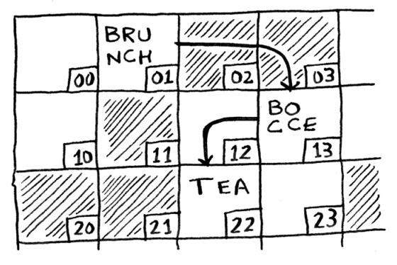
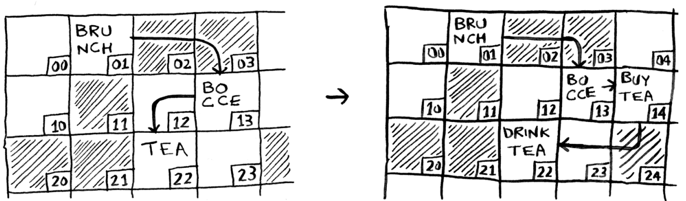

# Linked Lists
## Description
- The information is stored anywhere in memory.
- Each element of the linked list knows where the following item is.

## Disadvantages
- Accessing items takes $O(n)$ cause we can not jump directly to an item, we need to go through the chain of the list before finding it. This is called **Sequential Access**

## Advantages
- The memory allocation is not a problem as items can be anywhere on memory. 
- In comparison to an Array, adding new elements is very fast, we are not restrained by memory distribution.

### Operations

1. Insertion
To insert on a linked list we just need to changing what the previous element points to.
- :white_check_mark: Linked lists are very good for insertion.

2. Deletion
Lists are better on this because we just need to update what the previous element points to.

3. Access = **SEQUENTIAL ACCESS**
To access data we have to go through the whole chain of the linked list so the run time is $0(n)$